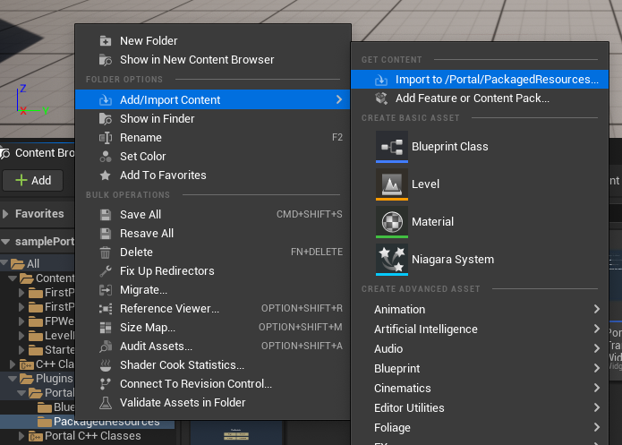

# Portal Unreal SDK

## Plugin Maintainers' Guide

### Prerequisites

- git
- Unreal Engine installed from the Epic Games Launcher or built from the source code. Make sure to check the list of currently supported Unreal Engine versions.
- Microsoft Visual Studio. It is crucial to have a compatible version of Visual Studio installed. Please refer to the official documentation of Unreal Engine.

### Getting Started

If you want to open the project and plugin in an IDE you'll need to create your Unreal project as a C++ project.  If you've already accidentally created your Unreal project as BluePrint-only you can convert it to a BluePrint-and-C++ project by adding any C++ class from the `Add New C++ Class` option in the Unreal Editor's `File` menu.

### Debugging the Embedded Browser

#### Embedded Browser Logs

See `Saved/Logs/cef3.log` in your Unreal project.

#### JS Console Output

In Unreal Engine 5.1+ the project is set up so that `console.log()` will pass all the way through to the Unreal console.  This isn't available in UE5.0 and earlier but you can still use Chromium's remote debugging (see below).

#### Remote Debugging

To set up Chromium remote debugging, edit project build/launch configurations in your IDE to add the following program command-line argument to the appropriate configurations: `cefdebug=9222`

Next, launch the game and then open a separate Chrome/Chromium browser and navigate to `chrome://inspect` where your app should be listed, sometimes intermittently or after a delay, under the `Remote Target #localhost` section.  Click `inspect` to launch the remote debugging session.

## Release Unreal Portal SDK Plugin

1. Release the plugin using GitHub releases. See https://github.com/portal/portal-unreal/releases

## Installation

1. Since `.uasset` and `.umap` files are stored on Git Large File Storage, you must download and install git-lfs from here before cloning the respository
2. Clone the portal-unreal repository or download the zip/tarball from one of the versions here
3. Copy the cloned repo into your project's Plugins folder, e.g.: MyGame/Plugins/portal-unreal
4. Restart your project (Unreal Editor & Jetbrains Rider IDE), upon restart it should load the unreal-sdk-plugin and should be good to use

## Setup
### Blueprint
See the included sample widgets in All->Plugins->Portal Content in the Unreal Editor content browser for examples of how to use the plugin in Blueprint. If you don't see a Plugins folder under All you may need to enable Show Plugin Content in the content browser's Settings menu.

### C++
Check out the PortalIdentity.h file for the C++ Identity API. In order to know the list of methods to call for the Identity Login Flow and the Identity Log out Flow, follow the same sequence of steps as the Blueprint widget examples below.

## How to Add Game Bridge Asset to Packaged Resources

1. Open Unreal Editor in the lowest supported version (i.e. 4.26) for this Plugin.
2. Open Content Drawer
3. Navigate to Plugins -> Portal Content -> Packages Resources
4. Delete the existing imported `index.uasset`
5. Right click and import the `index.js` file
   
